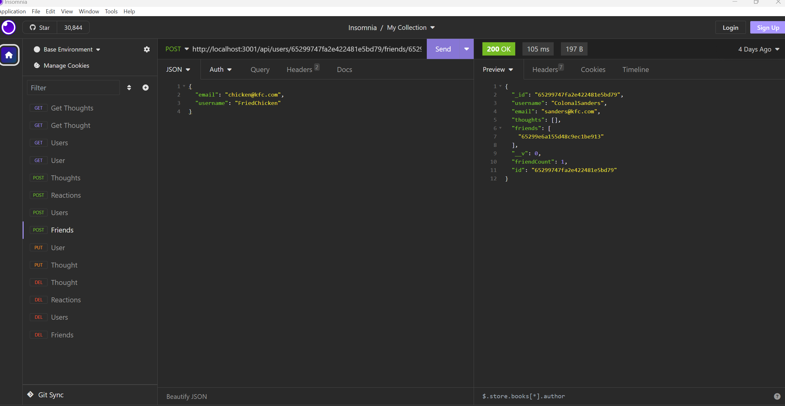

# Social Network Application

## Table of Contents

* [Description](#description)
* [Links](#links)
* [Purpose](#purpose)
* [Screenshots](#screenshots)
* [Video](#video)
* [Technologies Used](#technologies)
* [Licence](#license)

## Description

This application serves as an API for social network that uses a NoSQL database, and  can handle large amounts of unstructured data
## Links
<a href="https://github.com/ColumbiaCoding/antisocialNetwork.git">Link to Github Repo</a>

## Purpose

Create the framework for a social network that can handle large amounts of unstructured data

## Screenshots

## Video

<a href="https://drive.google.com/file/d/1WeN9vkFiY5b225xs5hFzBbV393V1bsEe/view">Link to Video</a>

## Technologies

## License

